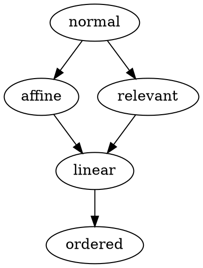

# Discussion

## 2023-03-14

What if you could specify a type system to use as an effect handler for a region
of code? This seems like it would interact with co-data and resemble monads.

Perhaps the base language would be a full structural type system, then you could
specify that you want contraction disabled for a region and you have affine
types.

It would allow for domain-specific type systems.

Dependent types seem to be on a separate axis from substructural type systems,
but probably not orthogonal.

## 2023-03-16

### Topic 1

They combine linear and non-linear types, with the restrictions that non-linear
structures must not contain any non-linear components and that non-linear
functions may only be introduced in environments containing only non-linear
types. This would seem to imply that non-linear types must be at the top level
in a combined system. If this was extended to support all substructural type
systems, what would it look like?

As stated on [Wikipedia](https://en.wikipedia.org/wiki/Substructural_type_system),
the substructural type systems are:

|          | Exchange | Weakening | Contraction | Use                   |
| -------- | -------- | --------- | ----------- | --------------------- |
| Ordered  | —        | —         | —           | Exactly once in order |
| Linear   | Allowed  | —         | —           | Exactly once          |
| Affine   | Allowed  | Allowed   | —           | At most once          |
| Relevant | Allowed  | —         | Allowed     | At least once         |
| Normal   | Allowed  | Allowed   | Allowed     | Arbitrarily           |

Would this then be the hierarchy of embedding (with transitive edges omitted)?

This would enable selective restrictions on types for regions of code.

#### Response

I had overlooked that `let!` may enable a reversal of these edges, within
itself, so the lattice might be from most- to least-expressive for types and
least- to most expressive for values.

Higher systems can model lower systems:

- Ordered types: modeled as a stack (ordered access)

- Linear: modeled as a map (random access)
  - It can alternatively be modeled as a stack, with an additional operation that
    swaps the top and nth values.

- Affine: modeled as a map with discard

- Relevant types:
  - It seems analogous to the regexp x+, which decomposes to xx*, in that it can
    be seen as values first being linearly typed, then once used, becomes
    normal-typed. That could possibly be represented as partitions of values.

Relevant types initially seem less useful, but find use in forbidding dead code.
It is usually enforced by lints, like the Go compiler forbidding dead code, so
in that sense, Go may be considered relevantly typed. It is useful in dataflow
languages.

### Topic 2

How would linear types interact with dependent types? Linear dependent types
would ideally enforce the exactly-once constraint for values, yet allow types to
reference linear values arbitrarily.

#### Response

I should read “Integrating Dependent and Linear Types” (Krishnaswami, Pradic,
and Benton 2015) [[pdf](https://www.cl.cam.ac.uk/~nk480/dlnl-paper.pdf)]. Their
approach for linear dependent types uses category theory (probably the Lambek in
the Curry–Howard–Lambek correspondence), but is not simple.
